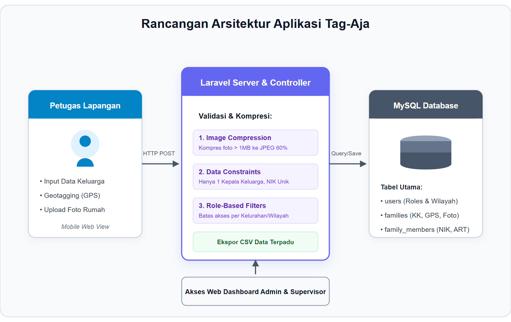
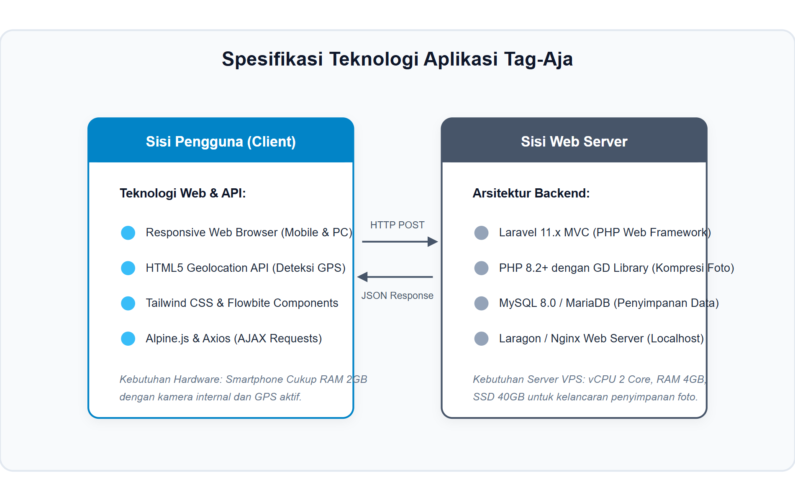
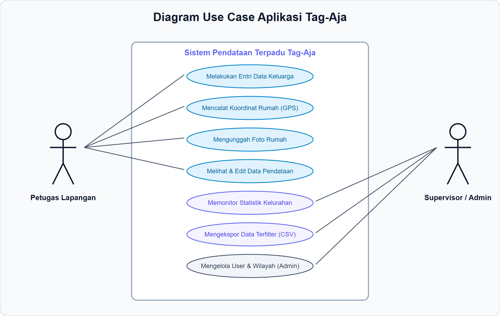
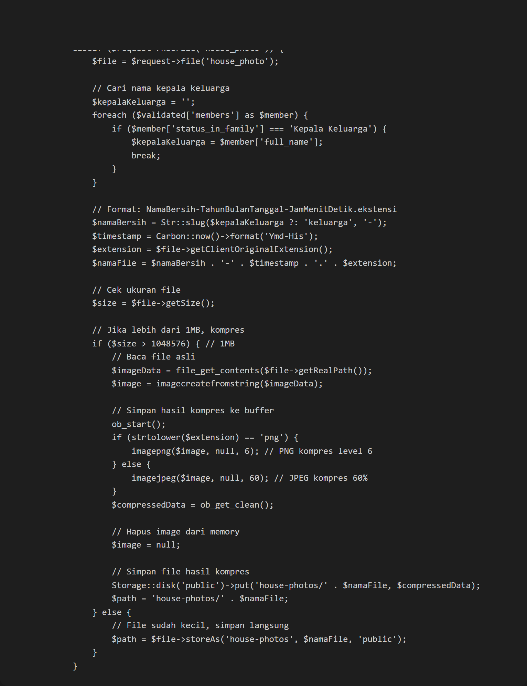
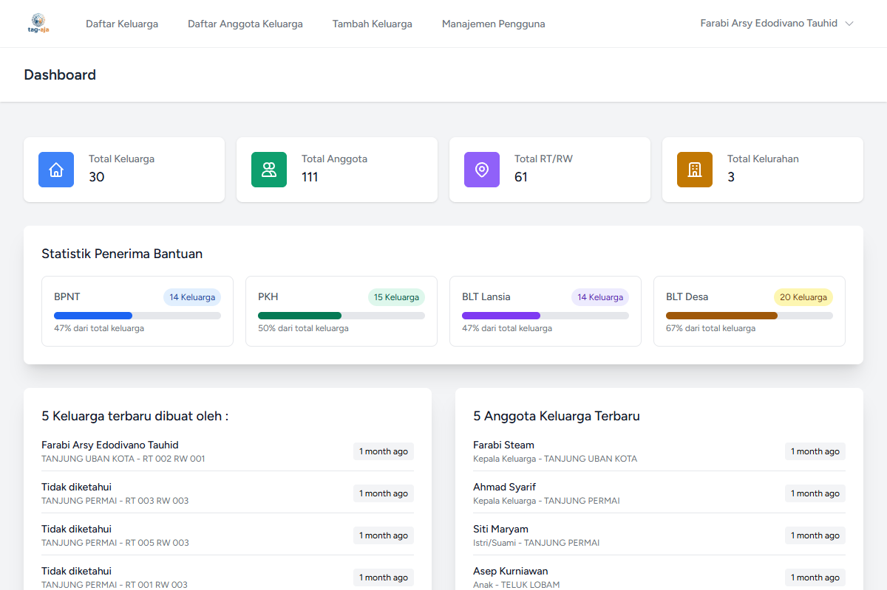
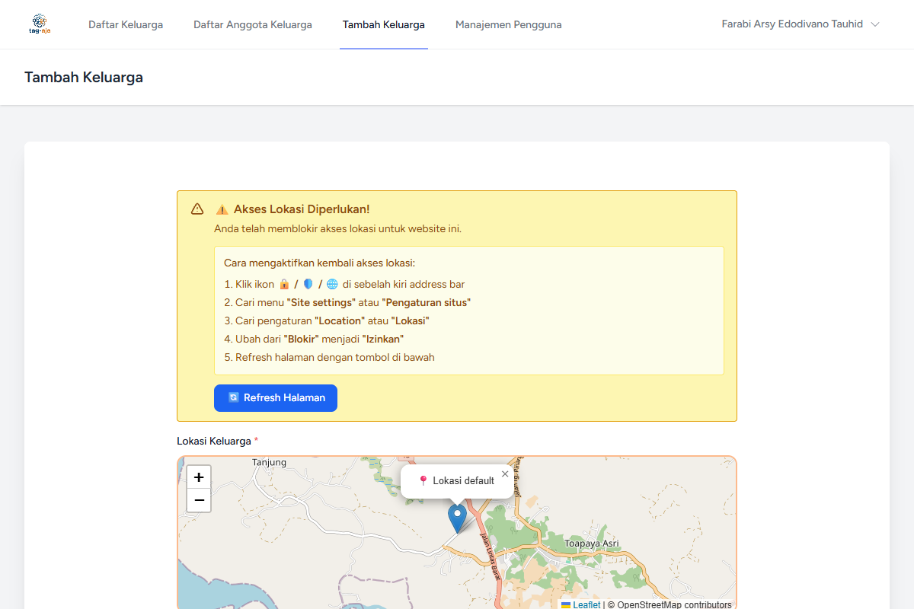
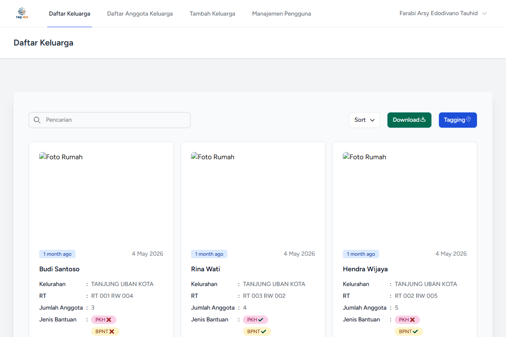
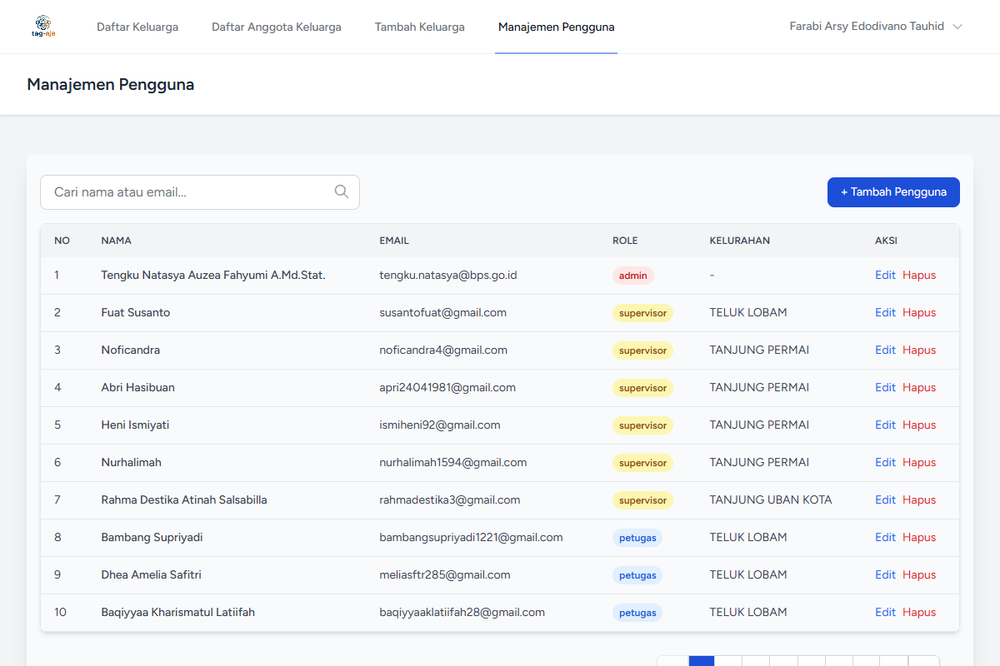

# STUDI RANCANG BANGUN/BLUEPRINT
# APLIKASI PENDATAAN KELUARGA TERPADU (TAG-AJA)

Sebagai penyedia layanan sosial dan bantuan pemerintah di tingkat daerah, instansi berkomitmen untuk menyajikan pelayanan pendataan kemiskinan dan penyaluran jaring pengaman sosial yang akurat, transparan, dan akuntabel. Pendataan keluarga di lapangan merupakan elemen vital dalam penyaluran bantuan sosial. Namun, metode manual berbasis kertas seringkali menimbulkan kendala seperti tingkat data ganda (duplikasi NIK), tidak adanya verifikasi fisik kondisi rumah, serta lambatnya proses rekapitulasi data.

Untuk mengatasi permasalahan tersebut, dikembangkan **Aplikasi Tag-Aja (Pendataan Keluarga Terpadu)**. Aplikasi ini adalah sistem manajemen pendataan kesejahteraan sosial berbasis web responsif yang mengintegrasikan pemetaan koordinat GPS (*geotagging*) dan kompresi foto fisik rumah langsung dari browser *smartphone* petugas di lapangan. Sistem ini dirancang untuk menyederhanakan entri data keluarga, memperketat validasi demografis (keharusan memiliki hanya satu Kepala Keluarga dan keunikan NIK), menyaring hak akses data berdasarkan zona kelurahan (Supervisor), serta menyajikan dasbor analitik bagi pimpinan daerah. Dokumen studi rancang bangun (*blueprint*) ini disusun sebagai acuan teknis operasional.

---

## 1. Perancangan Aplikasi
Perancangan aplikasi menggambarkan alur interaksi pengguna dengan sistem Tag-Aja, dimulai dari petugas lapangan yang mendatangi rumah responden, menginput data keluarga secara digital, mengambil foto kondisi rumah, dan merekam koordinat GPS, hingga proses validasi oleh supervisor kelurahan dan monitoring oleh administrator.

*Gambar 1. Rancangan Aplikasi Tag-Aja*

Pada **Gambar 1**, dapat dilihat alur integrasi arsitektur sistem Tag-Aja:
1. **Pendataan Mandiri Petugas**: Petugas mengakses aplikasi di lapangan melalui mobile browser, menginput data kependudukan, merekam koordinat GPS (*Geotagging*), dan mengunggah foto bukti fisik rumah tinggal.
2. **Pemrosesan & Validasi Server**: Server Laravel memproses data yang diunggah. Jika ukuran foto melebihi 1MB, sistem otomatis melakukan kompresi (*on-server image compression*) sebelum menyimpannya ke storage. Data divalidasi silang agar tidak ada NIK ganda dan membatasi hanya boleh ada satu Kepala Keluarga per formulir.
3. **Penyimpanan Data Terpusat**: Data yang valid disimpan ke dalam basis data MySQL secara aman.
4. **Monitoring & Evaluasi**: Supervisor Kelurahan masuk ke dasbor dan memantau kumulatif data yang masuk khusus di areanya masing-masing. Administrator memiliki akses penuh untuk mengelola pengguna (petugas/supervisor) dan mengekspor seluruh database ke dalam berkas CSV.

---

## 2. Penyusunan Spesifikasi Teknologi yang Digunakan
Penyusunan spesifikasi teknologi menetapkan standar minimum perangkat keras (*hardware*) dan perangkat lunak (*software*) agar sistem Tag-Aja dapat berjalan dengan optimal di lapangan maupun di kantor.

*Gambar 2. Spesifikasi Teknologi Aplikasi Tag-Aja*

Spesifikasi teknologi yang digunakan adalah sebagai berikut:

### A. Sisi Client (Petugas & Operator)
1. **Perangkat Lunak (Software)**: Web Browser modern dengan dukungan HTML5, CSS3, dan Geolocation API (Google Chrome Mobile, Safari Mobile, atau Firefox Mobile).
2. **Perangkat Keras (Hardware)**: Smartphone kelas menengah (Processor Octa-Core, RAM 2GB, Storage 16GB) dengan kamera internal dan GPS aktif.

### B. Sisi Server & Database
1. **Perangkat Lunak (Software)**:
   - Sistem Operasi Server (Linux Ubuntu 20.04 LTS / Windows Server).
   - Bahasa Pemrograman **PHP versi 8.2** ke atas.
   - Framework **Laravel versi 11.x**.
   - Server Database **MySQL versi 8.0** atau MariaDB versi 10.4 ke atas.
   - Web Server (Nginx atau Apache, dikelola menggunakan Laragon/XAMPP).
   - PHP GD Library untuk fungsi kompresi gambar otomatis.
2. **Perangkat Keras (Hardware)**: Server VPS/Cloud (Minimal 2 vCPU, RAM 4GB, Storage SSD 40GB).

---

## 3. Diagram Use Case Aplikasi Tag-Aja
Diagram use case memetakan fungsionalitas sistem berdasarkan peran pengguna (*actor*) yang terlibat. Terdapat tiga aktor utama pada sistem Tag-Aja: **Petugas Lapangan**, **Supervisor Kelurahan**, dan **Administrator**.

*Gambar 3. Diagram Use Case Aplikasi Tag-Aja*

### Deskripsi Peran Aktor:
1. **Petugas Lapangan**:
   - **Melakukan Entri Data**: Menginput identitas keluarga (KK dan Anggota Keluarga) di lokasi hunian.
   - **Mencatat Koordinat Rumah**: Memanfaatkan GPS browser untuk mencatat data spasial.
   - **Mengunggah Foto**: Mengambil foto hunian secara langsung.
   - **Kelola Data Sendiri**: Melihat dan menyunting data pendataan yang diinput oleh akunnya sendiri.
2. **Supervisor Kelurahan**:
   - **Monitoring Statistik Kelurahan**: Melihat visualisasi data kemiskinan khusus di wilayah kerjanya.
   - **Ekspor Laporan**: Mengekstrak data kelurahannya ke format CSV untuk tindak lanjut penanganan sosial.
3. **Administrator**:
   - **Akses Penuh Seluruh Wilayah**: Memantau data teragregasi lintas kelurahan.
   - **Manajemen Pengguna**: Mendaftar, menyunting, dan menghapus akun Petugas atau Supervisor.
   - **Konfigurasi Master Data**: Mengatur data wilayah (Kelurahan dan RT/RW).

---

## 4. Penulisan Kode Aplikasi Program
Penulisan kode program Tag-Aja dibangun di atas arsitektur MVC (Model-View-Controller) bawaan framework **Laravel 11**. Struktur backend didesain untuk menangani otomatisasi kompresi file gambar beresolusi tinggi guna mencegah pembengkakan penyimpanan. Berikut adalah potongan kode backend pada controller yang menangani validasi, pemrosesan foto, dan kompresi file JPEG/PNG secara atomik sebelum disimpan ke disk penyimpanan server:

*Gambar 4. Potongan Kode Validasi & Kompresi Gambar pada FamilyController.php*

Fungsi di atas menjamin:
- Server terhindar dari kehabisan kuota penyimpanan (*out-of-quota*) akibat foto asli berukuran besar.
- File gambar di atas 1MB ditekan ukurannya hingga 60% untuk JPEG atau level kompresi 6 untuk PNG di memori sebelum disimpan.
- Petugas di lapangan dapat beroperasi cepat tanpa kendala jaringan akibat mengunggah file mentah.

---

## 5. Pembuatan Mobile App Aplikasi Layanan Data
*(Tahapan ini ditiadakan karena aplikasi Tag-Aja difokuskan penuh pada platform Web Responsive Mobile-Friendly yang dapat diakses langsung oleh petugas lapangan tanpa perlu melakukan instalasi aplikasi mobile terpisah).*

---

## 6. Implementasi Sistem
Setelah melalui tahapan perancangan dan pengodean, aplikasi Tag-Aja diimplementasikan dan diuji secara lokal di lingkungan pengembangan Laragon. Berikut adalah tangkapan layar (*screenshot*) asli dari fungsionalitas utama aplikasi yang telah berjalan:

### A. Tampilan Dasbor Utama Admin & Supervisor
Dasbor utama menyajikan statistik ringkasan data, jumlah keluarga yang terdata, visualisasi bagan cakupan bantuan sosial (PKH, BPNT, BLT), dan aktivitas pendataan terbaru.

*Gambar 5. Halaman Dasbor Utama dengan Rekapitulasi Data & Chart bantuan sosial*

### B. Formulir Pendataan Keluarga & Geotagging
Formulir input data bagi petugas lapangan untuk mencatat identitas Kepala Keluarga, status bantuan, mengambil koordinat GPS, dan mengunggah foto rumah.

*Gambar 6. Formulir Pendataan Keluarga Baru beserta input koordinat spasial*

### C. Tabel Manajemen Data Keluarga
Halaman tabel yang memuat daftar keluarga yang telah terdata, lengkap dengan filter kelurahan, fungsionalitas ekspor CSV, serta opsi aksi detail, edit, dan hapus.

*Gambar 7. Daftar Tabel Keluarga Terdata dengan Opsi Manajemen & Ekspor*

### D. Dasbor Manajemen Pengguna (User Management)
Halaman khusus administrator untuk mengelola pendaftaran user baru (Petugas/Supervisor), penentuan wilayah tugas kelurahan/RT, serta pengelolaan hak akses keamanan sistem.

*Gambar 8. Halaman Manajemen Pengguna untuk Konfigurasi Peran & Hak Akses*
